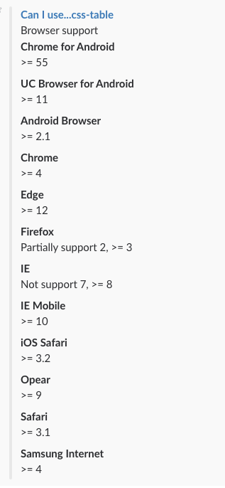

## easy-caniuse

Get result by [caniuse-api](https://github.com/Nyalab/caniuse-api) but wrap return format with [slack-message-builder](https://github.com/BeepBoopHQ/slack-message-builder)

### API

Same API just like caniuse-api but return human friendly message using slack attachments.

